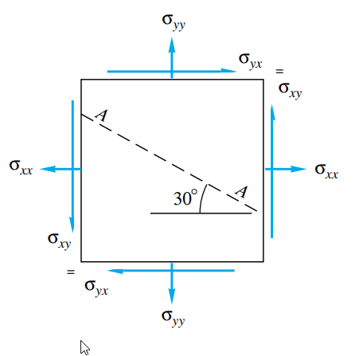

# Estática dos Fluidos {#estatica}

Muitos sistemas de engenharia usam reservatórios de fluidos, como os tanques de combustíveis em automóveis ou os reservatórios de rejeitos em minas; infelizmente, temos no Brasil exemplos trágicos de rompimentos de barragens, como em [Mariana](https://g1.globo.com/minas-gerais/noticia/2015/11/barragem-de-rejeitos-se-rompe-em-distrito-de-mariana.html) e [Brumadinho](https://g1.globo.com/mg/minas-gerais/noticia/2019/01/25/bombeiros-e-defesa-civil-sao-mobilizados-para-chamada-de-rompimento-de-barragem-em-brumadinho-na-grande-bh.ghtml), quando o material estrutural não conseguiu aguentar as forças que o fluido exerciam sobre ele.

Todo elemento de fluido que sofre ação de forças externas desenvolve uma *distribuição de tensões internas* que contra-balança essas forças externas, como a pressão atmosférica ou a ação gravitacional.

Considere os problemas P2.1 e P2.2 de [@bib:white4]: dado o elemento da Fig.  \@ref(fig:tensoes), e se algumas tensões são especificadas, como calcular as outras? A chave é que, *se o fluido está em equilíbrio*, então o somatório de forças é nulo em todas as direções.

```{r tensoes, fig.cap="Elemento de fluido sob tensão. Fonte: [@bib:white4]", echo=FALSE}

```

AS SOLUÇÕES ABAIXO ESTÃO ERRADAS E PRECISAM SER ATUALIZADAS, BEM COMO EQUAÇÕES.

Em Python, solução do P2.1:

```{python}
from numpy.linalg import solve
import numpy as np
from math import sin, cos, radians, pi

sigmaxx = 143640
sigmayy = 95760
sigmaxy = 23940
angle = 30
theta = radians(angle)

A = np.array(
  [[cos(pi/2-theta), -cos(theta)],
  [sin(pi/2-theta), sin(theta)]]
)
b = np.array([sigmaxx+sigmaxy,sigmayy+sigmaxy])
x = solve(A,b)
sigmaA, tauA = x
print("Tensão normal sobre plano A, apontando para fora = %.2f N/m2" %(sigmaA))
print("Tensão cisalhante sobre plano A, apontando para cima = %.2f N/m2" %(tauA))
```

No P2.2 a *condição de equilíbrio* é a mesma, mas as incógnitas são diferentes:

```{python}
from numpy.linalg import solve
import numpy as np
from math import sin, cos, radians, pi

sigmaxx = 95760
sigmayy = 143640
sigmaA = 119700
angle = 30
theta = radians(angle)

A = np.array(
  [[-cos(theta), -cos(theta)],
  [-sin(theta), sin(theta)]]
)
b = np.array([sigmaxx*sin(theta)-sigmaA*sin(theta),sigmayy*cos(theta)-sigmaA*cos(theta)])
x = solve(A,b)
sigmaxy, tauA = x
print("Tensão cisalhante xy = %.2f N/m2" %sigmaxy)
print("Tensão cisalhante sobre plano A, apontando para cima = %.2f N/m2" %(tauA))
```

O que causa esta distribuição de tensões em um fluido? Se ele está estático, não existem forçcas viscosas (pois se existissem tensões de cisalhamento, por menor que sejam, o fluido escoaria - está é a definição de fluido [@bib:white4]). Na maioria das aplicações de engenharia, a distribuições de tensões estáticas se equilibra com o *peso*: a gravidade puxa o fluido "para baixo", e a pressão cresce nessa direção para suportar o peso.

## Distribuição de pressão

A pressão é, poranto, a tensão normal que atua em um fluido quando ele está parado.

### E se a densidade varia?

## Forças sobre comportas

## Movimentos de corpo rígido
