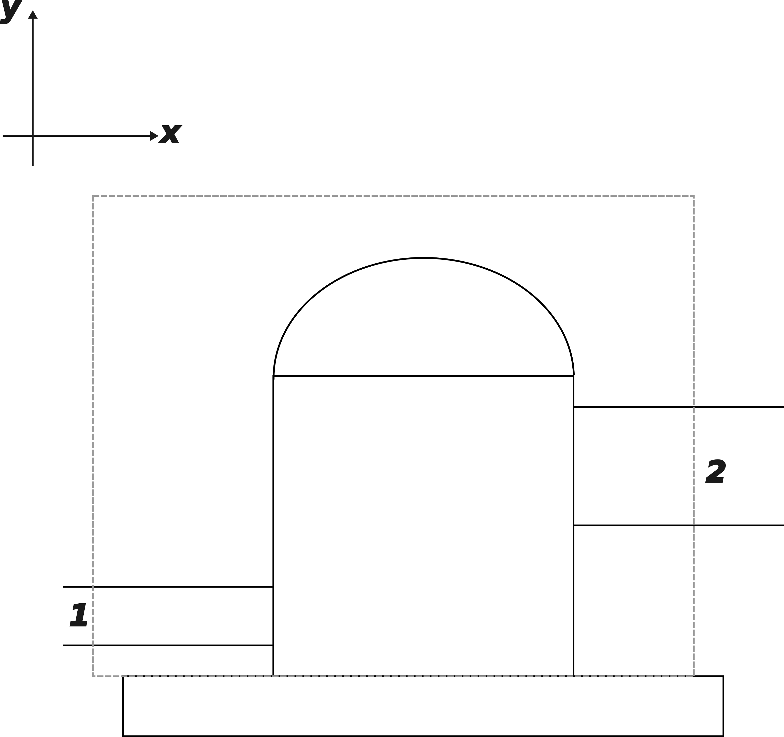

# Formulação Integral das Equações de Conservação da Massa, da Quantidade de Movimento Linear, da Quantidade de Movimento Angular e da Energia {#integral}

A disciplina de mecânica dos fluidos é uma das primeiras do chamado *Ciclo Profissionalizante* da Engenharia Mecânica, onde estudantes acabaram de sair do *Ciclo Básico* e suas aulas de Álgebra, Cálculo, Física e Desenho, e estão prontos para analisar problemas mais realistas de engenharia. Especificamente na disciplina de Mecânica dos Fluidos, acabam encontrando um paralelo com as aulas de Cálculo, na forma da comparação entre a *Análise Diferencial* e a *Análise Integral* de sistemas de escoamentos de fluidos.

De minha experiência como aluno e depois como pesquisador e como professor, tenho a impressão de que existe um certo viés de achar que a análise integral é mais fácil que a análise diferencial, mas isso é altamente dependente do problema. Na minha dissertação de mestrado [@bib:dissertacao], eu usei um modelo integral para a formação de espuma em misturas de óleo lubrificante e fluidos refrigerantes, pois eu não estava interessado em calcular ponto a ponto a concentração de refrigerante. Deixe-me dizer: não foi nada fácil desenvolver, implementar e testar esse modelo! A análise diferencial não ia me ajudar em nada, pois o meu objetivo era calcular a quantidade total de refrigerante que se desprendia do óleo.

Muito se fala então que a formulação integral permite cálculos globais, enquanto que a análise diferencial se dedica a cálculos mais refinados. Neste ensaio, vou enfatizar a seguinte distinção: a formulação integral ajuda o engenheiro a *escolher* bombas, enquanto que a análise diferencial permite à engenheira *projetar* essas mesmas bombas. 

## Exemplo de formulação integral em Mecânica dos fluidos

Na Fig. \@ref(fig:pump) temos um esquema de uma bomba hidráulica, que succiona de uma tubulação e descarrega em outra. Essa bomba está conectada a um motor, que não está mostrado na figura, e é feita de uma carcaça bastante grossa de maneira que não troca calor com o ambiente, e esta mesma carcaça está presa por parafusos (não mostrados) em uma base retangular que está concretada no solo.

Nós então traçamos um volume de controle fixo no espaço que atravessa as tubulações de sucção e descarga, o eixo do motor e os parafusos de fixação. O fato do volume de controle ser fixo facilita bastante os cálculos, mas modificações dessa situação (por exemplo, na seleção de turbinas de avião que se movimentam no espaço, onde o volume de controle viaja junto com a turbina) podem ser realizadas. 

```{r pump, fig.cap="Volume de controle (linha tracejada) traçado sobre uma bomba hidráulica em um sistema cartesiano", echo=FALSE}

```

As formulações de conservação clássicas da Mecânica são feitas em tornos de um sistema fechado - uma massa fixa de fluido. A conversão para a formulação de um *volume de controle fixo* são feitas através do *Teorema de Transporte de Reynolds*, e aplicações dos quatro princípios mostrados no título deste capítulo serão mostradas a seguir.

## Conservação da Massa

## Conservação da Quantidade de Movimento Linear

## Conservaçãoda Quantidade de Movimento Angular

## Conservação da Energia
